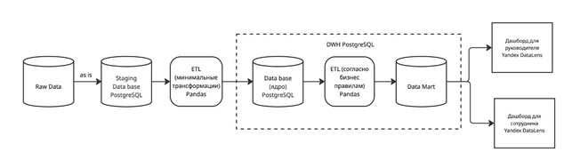
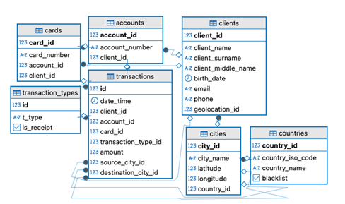
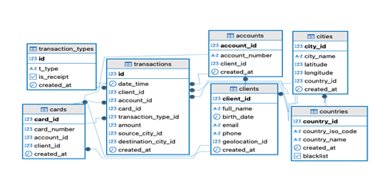
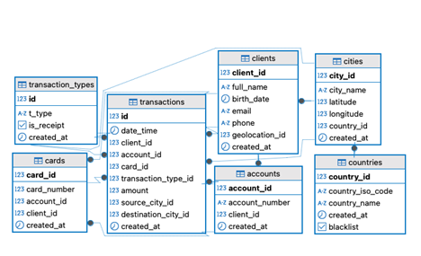
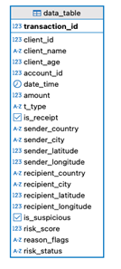
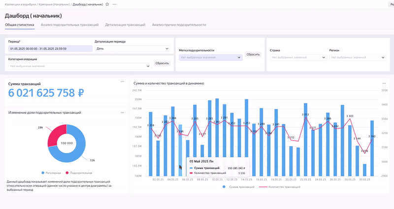
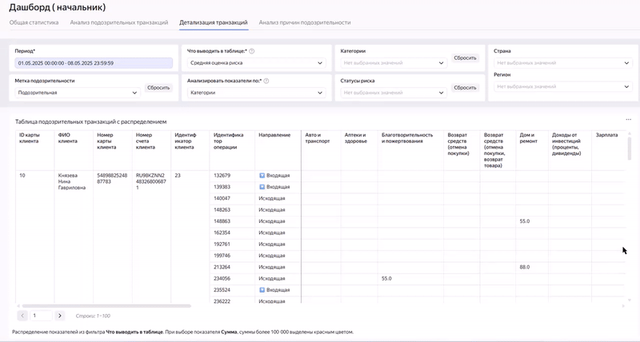

# Разработка системы выявления подозрительных транзакций для банка

## Содержание
1. [Описание проекта](#описание-проекта)
2. [Стек](#используемый-стек)
3. [Структура проекта](#структура-проекта)
4. [Установка и настройка](#установка-и-настройка)
5. [Функциональность](#функциональность)
6. [Визуализация](#примеры-визуализации)
7. [Цели проекта](#цели-проекта)


## Описание проекта
Данный проект представляет собой прототип системы автоматического выявления подозрительных финансовых транзакций, ориентированной на задачи внутреннего комплаенс-мониторинга в банке или финансовой организации.

Система предназначена для:

- Раннего выявления аномальной активности клиентов на основании анализа транзакционных данных.

- Присвоения каждой транзакции скорингового риска на основе настраиваемых критериев.

- Формирования витрины данных для последующего анализа и визуализации ключевых показателей в BI-инструменте.

Проект построен по архитектуре DWH (Data Warehouse) с полной ETL-цепочкой, позволяет обрабатывать, хранить и визуализировать данные, а также легко адаптироваться под изменение правил комплаенса и бизнес-логики.

Основная задача — создать масштабируемую, расширяемую систему, способную:

- Сократить время, необходимое на ручную проверку транзакций сотрудниками службы безопасности.

- Уменьшить количество ложноположительных срабатываний за счёт более точных и прозрачных правил.

- Повысить эффективность процедур, направленных на борьбу с отмыванием денег (AML) и соблюдение регуляторных требований.

- Обеспечить основу для внедрения машинного обучения на следующем этапе развития системы.

### Рабочий процесс

Ниже представлена BPMN-диаграмма, иллюстрирующая работу логики ETL:


### 1. Архитектура хранилища
- Источники данных – база данных банка, открытые базы данных сторонних сервисов.
- Слой сырых данных – данные перенесенные из источников данных (в исходном состоянии).
- DWH – база данных, состоящая из ядра и витрины данных. Витрина хранит агрегированные данные, готовые для использования в BI.
- Дашборд - интерактивная визуализация данных.

 

*Архитектура ИС: от базы данных до BI-витрины*  


### 2. База данных банка
Внутренняя инфраструктура заказчика, используемая в качестве источника данных.

Логическая модель:
 


### 3. Слой `staging`
Слой сырых данных - данные, перенесенные из источников данных (в исходном состоянии).

Логическая модель:
 

### 4. Слой `core`
Ядро - хранит очищенные и обогащенные данные.

Логическая модель:
 


### 5. Слой `data_mart`
Витрина хранит агрегаты, готовые для использования в BI.

Логическая модель:
 

---

## Используемый стек
### Бэкенд
- Python 3.12+
- PostgreSQL
- Docker

### Библиотеки
- SQLAlchemy
- psycopg2
- pandas
- numpy
- argparse
- python-dotenv
- logging
- faker

### Инструменты
- Yandex DataLens (для визуализации)


---

## Структура проекта
``` bash
├── docs/                       # Документация проекта
├── etl/                        # ETL-логика
│   ├── config/                 # Конфиги логирования
│   ├── Database/
│   │   ├── json/               # JSON-правила оценки риска
│   │   └── sql/                # SQL-скрипты создания и загрузки
│   ├── Models/                 # Модель для скоринга
│   ├── Генерация_...py         # Генерация синтетических данных
│   ├── loading_...py           # Загрузка из банка в staging
│   └── add_from_...py          # Загрузка из staging в core
├── src/
│   ├── gifs/                   # Гифки визуализаций
│   └── pictures/               # ER-диаграммы
├── .env                        # Файл окружения с параметрами
├── main.py                     # Главный скрипт — ETL + скоринг
├── database.py                 # Работа с PostgreSQL (extract/load)
├── risk_model.py               # Класс скоринга транзакций
├── requirements.txt            # Зависимости проекта
└── README.md                   # Описание проекта

```

---

## Установка и настройка

``` bash
# Клонировать репозиторий
git clone <repo_url>
cd <project_directory>
```
У вас будут 7 рабочих файлов:
- `Генерация_синтетических_файлов.py` - файл для генерации реалистичных данных о клиентах, банковских картах, счетах, транзакциях. Также выполняется загрузка в БД банка.
- `loading_bank_to_staging.py` - файл для загрузки сырых данных из БД банка на слой staging.
- `add_from_staging_to_core.py` - этот файл для преобразования данных со слоя staging на core.
- `main.py` - файл, реализующий ETL логику. Выполняет трансформацию данных.
- `database.py` - модуль для работы с базой данных PostgreSQL.  
Происходит преобразования информации согласно ETL логике, агрегация и загрузка на слой `data_mart`.
- `risk_model.py` - модуль, содержащий для скоринговой модели оценки риска транзакций.
- `risk_criteria.json` - файл, содержащий словарь правил оценки риска транзакций.

``` 
# Установить зависимости
pip install -r requirements.txt
```

``` bash
# Создать файл .env с параметрами подключения к БД
touch .env
```

```dotenv
# .env — пример конфигурации

# Путь к файлу правил скоринга
RISK_JSON=etl/Database/json/risk_criteria.json

# Подключение к БД банка
DB_NAME_BANK=bank
DB_HOST_BANK=localhost
DB_USER_BANK=your_user
DB_PASS_BANK=your_pass
DB_PORT_BANK=5432

# Подключение к DWH
DB_NAME_TRANSACTIONS=dwh_transaction
DB_HOST_TRANSACTIONS=localhost
DB_USER_TRANSACTIONS=your_user
DB_PASS_TRANSACTIONS=your_pass
DB_PORT_TRANSACTIONS=5433
DM_SHEMA_TRANSACTIONS=data_mart
DM_TABLE_TRANSACTIONS=data_table

```

Запустить скрипты SQL:
``` bash
# создает схему `bank` и таблицы
psql -h localhost -p 5432 -U your_user -d bank -f etl/Database/sql/creating_bank_tables.sql

# создает схему `staging` и таблицы
psql -h localhost -p 5433 -U your_user -d dwh_transaction -f etl/Database/sql/creating_staging_tables.sql

# создает схему `core` и таблицы
psql -h localhost -p 5433 -U your_user -d dwh_transaction -f etl/Database/sql/creating_core_tables.sql

```

---


## Функциональность

### 1. Генерация данных
`Генерация_синтетических_данных.py` - скрипт для создания реалистичных данных для загрузки в БД банка. В результате работы скрипта моделируется финансовая база данных:

#### 1.1. Клиенты
- Таблица `clients`
- Генерация 500 клиентов
- Используется библиотека `Faker` с русской локалью `ru_RU`
- Фамилия, имя, отчество
- Дата рождения ( 16 - 100 лет)
- Email (с учетом транслитерации имени и фамилии)
- Контактный телефон 
- `geolocation_id` - геолокация с точностью до населенного пункта


#### 1.2. Счета
- Таблица `accounts`
- Генерация 700 уникальных `account_id` и IBAN номеров
- Связь со случайными `client_id`


#### 1.3. Банковские карты
- Таблица `cards`
- Генерация 1000 случайных `card_id`
- Привязка к случайным счетам и клиентам
- Учитывается вероятность наличия у одного клиента нескольких карты.


#### 1.4. Справочник типов транзакций
- Таблица `transaction_types`
- Добавлено 46 категорий (оплаты, переводы, пополнения, возвраты, кэшбэк и прочее). В том числе категория "неизвестно" для корректной работы алгоритма.
- Метка `is_receipt` делит операции на расходы (0) и доходы (1)


#### 1.5. Транзакции
- Таблица `transactions`
- Генерация 5000 транзаций за май 2025
- Использованы клиенты, карты, счета и типы транзакций, сгенерированные ранее
- Суммы операций от 500 до 120000 руб.
- Указаны исходный и целевой `city_id`


#### 1.6. Загрузка городов и стран
- Использование `.txt` файла с геоданными, полученного из открытых источников
- Пометка "неблагонадежных" стран (blacklist), используя ISO-код этих стран, полученный из открытых источников. 

    Пример: 
    ```python
        black_list_iso = ['IR','MM','BG','BF','CM','HR','KE','CD','HT','JM','ML','MZ',
                      'NA','NG','PH','SN','ZA','SS','SY','TZ','TR','VN','YE']
    ```
- Присвоение клиентам исходных и целевых городов операций (Российских и зарубежных, 90% и 10% соответственно)


#### 1.7. Загрузка в PostgreSQL
- Подключение через SQLAlchemy
- Загрузка в БД банка всех таблиц, созданных на предыдущих этапах

---

### 2. Загрузка данных из БД банка в DWH
На этом этапе задействованы скрипты, запускаемые последовательно:
- `loading_bank_to_staging.py` - загрузка сырых данных из БД банка в DWH на слой `staging`
- `add_from_staging_to_core.py` - загрузка данных со слоя `staging` на слой `core`

Доступна загрузка как отдельных сущностей (например: таблицы клиентов, карт, счетов), так и всех сразу (с использованием аргумента `all`). Также, реализована логика инкрементальной загрузки: добавляются только записи, которых еще нет.

Ниже описан функционал файлов:

#### 2.1. Функции загрузки таблиц
Каждая функция (пример: `add_clients`, `add_cards`) выполняет следующее:
- Чтение данных из соответствующей таблицы из БД банка
- Проверка существующих `id`, добавление только новых данных.

    ``` python
        df_bank_countries = pd.read_sql_query( "SELECT * FROM bank.countries", con=engine_bank)
        
        df_staging_ids = pd.read_sql_query( "SELECT country_id FROM staging.countries", con=engine_transactions)
        
        id_rows_staging = df_staging_ids['id'].to_numpy()
        max_staging_id = np.max(id_rows_staging)
        
        df_bank_countries = df_bank_transaction_types[df_bank_transaction_types['id'] > max_staging_id].drop_duplicates()
    ```
- Добавления поля `created_at`


#### 2.2. Подключениек БД
- Использование переменных окружения из `.env`.
- Подключечение к БД с помощью `SQLAlchemy`.


#### 2.3. Парсинг аргументов командной строки и управление логикой загрузки
- Загрузка:
    ```bash
        python loading_bank_to_staging.py clients       #Загрузить только клиентов
        python loading_bank_to_staging.py all           #Загрузить всё
    ``` 
- Управление логикой:
    ``` python
        if args.loading == 'clients':
            add_clients()
        elif args.loading == 'all':
            add_countries()
            ...
            add_transactions()
    ```    


### 3. Реализация ETL логики
Алгоритм обнаружения подозрительных транзакций анализирует метрики транзакций и помечает их, если они считаются подозрительными:
- Сумма транзакции превышает 100 000 руб.
- Транзакция совершена в ночное время (00:00–06:00).
- Обнаружено резкое изменение геолокации (перемещение клиента на > 500 км между транзакциями).
- Клиент совершил более 7 транзакций за последние 2 часа.
- Обнаружены множественные малые переводы (несколько транзакций в течение 1 часа от 1000 руб., общая сумма ≥ 20 000 руб.).
- Указана неопознанная категория перевода.
- Перевод направлен в "неблагонадежные" страны.
- Возраст клиента более 60 лет.

Алгоритм присваивает уровень риска каждой подозрительной транзакции (обычная, требует проверки, подозрительная) на основе количества и критичности сработавших метрик.
Реализовано в нескольких файлах:
- `main.py` -  Отвечает за загрузку DataFrame с транзакциями из слоя core и его обогащение дополнительными признаками с использованием вспомогательных функций.
    - `compute_age()` - Функция добавляет к DF столбец 'client_age': возраст клиента.
    - `detect_large_amounts()` - Признак: 'Большая сумма операции (Сумма > 100 000 руб.). Функция добавляет к DF булев столбец 'risk_big_sum': TRUE если сумма транзакции превышает 100 000 руб.
    - `detect_night_transactions()` - Признак: 'Операции в ночное время (00:00–06:00).
    Функция добавляет к DF булев столбец 'risk_night_time': TRUE если транзакция проводилась в этот промежуток.
    - `detect_geolocation()` - Признак: 'Резкое изменение геолокации (изменение > 500 км.). Функция добавляет к DF булев столбец 'risk_geolocation_change': TRUE если геопозиция совершенной транзакции
    по сравнению с предыдущей отличается не менее чем на 500 км. в течение 1 ч.
    - `detect_operation_rate()` - Признак: 'Увеличение числа операций за короткое время. Функция добавляет к DF булев столбец 'oper_rate': 
    TRUE, если за последние 120 мин. до текущей транзакции (включая её) клиент совершил более 7 транзакций.
    - `detect_small_sums()` - Признак: 'Несколько маленьких сумм вместо одной большой. Добавляет булев столбец 'small_sum':
    TRUE, если за последние 60 мин. сумма мелких транзакций превысила 20 000 руб.
    - `detect_none_type()` - Признак: 'Категория перевода (Неизвестная). 
    Функция добавляет к DF булев столбец 'none_type': TRUE, если тип транзакции - неизвестный.

#### Признаки подозрительных операций
Оценивается каждая транзакция на основе набора признаков, каждый из которых добавляет определённое количество баллов риска. Превышение порогового значения баллов может сигнализировать о подозрительной активности.

| Критерий                                      | Баллы | Описание |
|----------------------------------------------|:------:|----------|
| **Большая сумма**                             | 50     | Сумма транзакции > 100 000. Высокий риск отмывания средств, обхода лимитов или мошенничества. |
| **Операции в ночное время**                   | 50     | Временной диапазон: 00:00–06:00. Характерно для мошеннической активности. |
| **Резкое изменение геолокации**               | 50     | Расстояние между текущей и предыдущей транзакцией клиента > 500 км за короткий промежуток времени (например, 1 час). Указывает на компрометацию данных. |
| **Увеличение числа операций**                 | 30     | Резкий всплеск активности (например, количество операций за сутки значительно превышает среднее за месяц). Может указывать на попытку быстро вывести средства. |
| **Несколько маленьких сумм вместо одной большой** | 30     | Серия мелких переводов (например, по 1–5 тыс.) в течение короткого времени, которые в сумме превышают пороговую сумму. Подозрение на дробление платежей. |
| **Категория перевода: "Неизвестная"**         | 30     | Тип транзакции не определён, отсутствует в справочнике, не имеет чёткого назначения. Может маскировать запрещённую деятельность. |
| **Переводы в рискованные страны**             | 40     | Получатель находится в юрисдикции, включённой в чёрный список (например, FATF, OFAC и др.). Независимо от суммы или времени — это критический флаг. |

Некоторые характеристики клиентов усиливают общий риск транзакции, увеличивая итоговый скоринг.

| Критерий                   | Баллы / Поведение            | Описание |
|----------------------------|------------------------------|----------|
| **Клиент в возрасте 60+** | +20 баллов или +10% ко всем баллам | Люди пожилого возраста чаще становятся жертвами мошенников. При наличии других признаков — повышает риск. |

#### Использование
```pycon
df_main = ( df_transactions

        # Добавляем возраст клиентов
        .pipe(compute_age)
    
        # Добавляем колонки с приоритетными признаками
        .pipe(detect_large_amounts)
        .pipe(detect_night_transactions)
        .pipe(detect_geolocation)
    
        # Добавляем колонки с вторичными признаками
        .pipe(detect_operation_rate)
        .pipe(detect_small_sums)
        .pipe(detect_none_type))
```

- `risk_model.py` - Модуль, содержащий класс `RiskScoringModel `для скоринговой модели оценки транзакций. Загружает весовые коэффициенты из JSON-файла и рассчитывает для каждого клиента
и каждой транзакции:
    - `risk_score`: суммарный скоринговый балл.
    - `risk_status`: статус транзакции.
    - `reason_flags`: список причин.

Вызываемые функции:
   1. - `__init__()` - Инициализация модели.
   2. - `extract_feature_scores()` - Возвращает словарь признаков в формате: { 'column': {'score': value, 'reason': feature_name}, ... }.
   3. - `calculate_scores()` - Добавляет в DataFrame столбцы:
        - risk_score: суммарный балл по булевым столбцам.
        - risk_status: один из ['Обычная', 'Требует проверки', 'Подозрительная'], выбираемый по критериям.


#### Использование
``` pycon
risk_model = RiskScoringModel(RISK_JSON)

df_calculated_risks = risk_model.calculate_scores(df_main)
```
    
- `database.py` - Модуль для работы с БД. Содержит класс `DBExtractor`, функции которого позволяют осуществлять загрузку/выгрузку из БД и производить манипуляции с таблицами.
    - `__init__()` - Инициализирует подключение к БД, используя библиотеку SQLAlchemy.
    - `_load_sql()` - Читает SQL из файла.
    - `_fetch_df()` - Выполняет SQL и возвращает результат в DataFrame.
    - `create_datamart()` - Выполняет DDL-скрипт по созданию схемы и таблицы витрины.
    - `load_datamart()` - Загружает финальные данные в витрину.
    
#### Использование
```pycon
extractor = DBExtractor(dbname=DB_NAME, user=DB_USER, password=DB_PASS, host=DB_HOST, port=DB_PORT) #Инициализация класса.

df_transactions = extractor.fetch_merged_transactions() # Загрузка данных их схемы core и дополнение DataFrame новыми столбцами.

df_info = extractor.fetch_merged_info() # Чтение справочной информации из БД, необходимой для витрины.

extractor.create_datamart() # Создание витрины.

extractor.load_datamart(df_data_mart, DM_SHEMA, DM_TABLE) # Загрузка в витрину.
```

#### Структура витрины:
| Поле                     | Тип данных          | Описание                            |
|--------------------------|---------------------|-------------------------------------|
| `transaction_id`         | INTEGER PRIMARY KEY | Идентификатор транзакции            |
| `client_id`              | INTEGER             | Идентификатор клиента               |
| `account_id`             | INTEGER             | Идентификатор счета                 |
| `date_time`              | TIMESTAMP           | Дата и время транзакции             |
| `t_type`                 | TEXT                | Категория операции                  |
| `is_receipt`             | BOOLEAN             | Исходящая/входящая операция         |
| `sender_country`         | TEXT                | Исходная страна транзакции          |
| `sender_city`            | TEXT                | Исходный город транзакции           |
| `sender_region`          | TEXT                | Исходный регион транзакции          |
| `sender_latitude`        | NUMERIC             | Геоданные. Широта отправителя       |
| `sender_longitude`       | NUMERIC             | Геоданные. Долгота отправителя      |
| `recipient_country`      | TEXT                | Целевая страна транзакции           |
| `recipient_city`         | TEXT                | Целевой город транзакции            |
| `recipient_region`       | TEXT                | Целевой регион транзакции           |
| `recipient_latitude`     | NUMERIC             | Геоданные. Широта получателя        |
| `recipient_longitude`    | NUMERIC             | Геоданные. Долгота получателя       |
| `is_suspicious`          | BOOLEAN             | Признак подозрительности транзакции |
| `risk_score`             | INTEGER             | Сумма баллов риска                  |
| `reason_flags`           | VARCHAR             | Список причин подозрительности      |
| `risk_status`            | VARCHAR             | Возраст клиента                     |

---

## Примеры визуализации 

### Описание экранов и форм, макеты (wireframes), прототипы
- Экран 1: Главный дашборд
    - Шапка: Название роли (Дашборд (начальник) / Дашборд (сотрудник) ).
    - Панель вкладок: вкладка общая статистика
    - Панель селекторов: период, детализация периода, метка подозрительности, категория операции, страна.
    - Графики, таблицы, значения: общая сумма транзакций, сумма и количество транзакций в динамике.



- Экран 2: Главный дашборд
    - Шапка: Название роли (Дашборд (начальник) / Дашборд (сотрудник)).
    - Панель вкладок: вкладка Анализ подозрительных транзакций
    - Панель селекторов: период, тип операций, операции в рискованных странах, категория операции, выбор единиц измерения, показать операции в промежутке, страна.
    - Графики, таблицы, значения: геоаналитика, распределение по часам, топ-10 подозрительных транзакций.


- Экран 3: Главный дашборд
    - Шапка: Название роли (Дашборд (начальник) / Дашборд (сотрудник) ).
    - Панель вкладок: вкладка Детализация Транзакций
    - Панель селекторов: период, что выводить в таблице, анализировать показатели по, метка подозрительности, статусы риска, страна, категории.  
    - Графики, таблицы, значения: таблица подозрительности транзакций с распределением



- Экран 4: Главный дашборд
    - Шапка: Название роли (Дашборд (начальник) / Дашборд (сотрудник)).
    - Панель вкладок: вкладка Анализ причин подозрительности
    - Панель селекторов: период, метка подозрительности, категории операции, причины подозрительности, показать возраст до, страна.
    - Графики, таблицы, значения: распределение рисков по сегментам клиентов, причины подозрительности по категориям.


### Навигация и взаимодействие

Горизонтальное меню:
- Панель заголовка– указание типа дашборда
- Панель вкладок: переключение между дашбордами.
- Панель селекторов: фильтрация данных
- Боковое меню – быстрый доступ к т.д. основным модулям.
- Хлебные крошки (Breadcrumbs) возле таблиц - Возможность экспорта
- Наведение курсора на график - получение точечных данных

---

## Цели проекта

Проект создан в учебных целях — это практическое задание в рамках стажировки.
